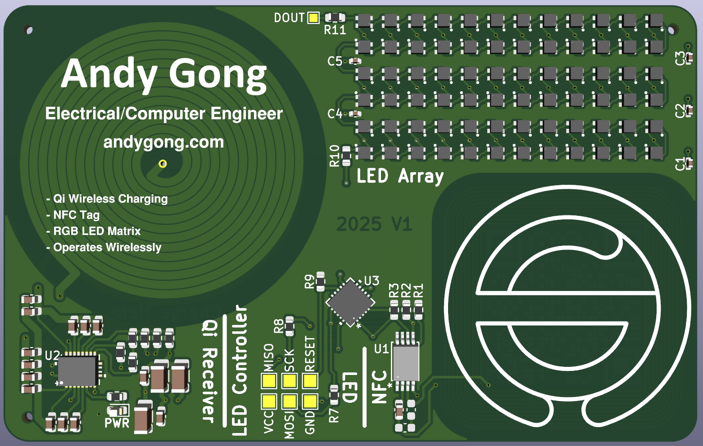
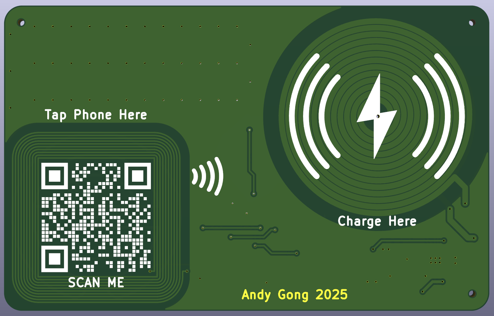
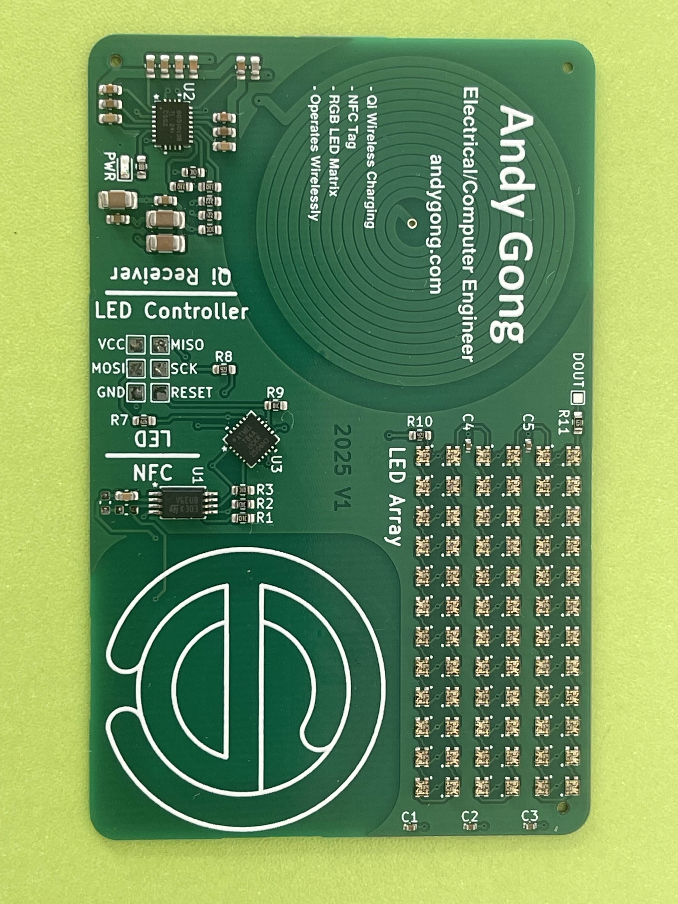
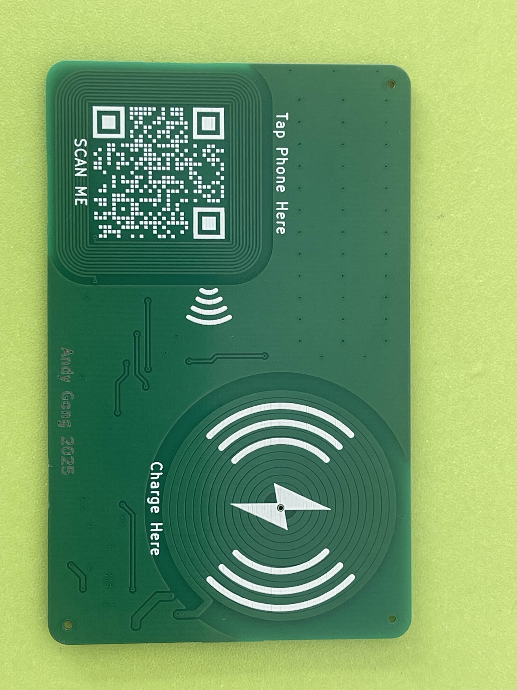

# pcb-business-card
Business card made using functional PCBs

Latest Revision: V1 (2025)

# Major Revisions:
## V1 (2025)
- Initial release of the PCB business card design.
- Qi Wireless charging support.
- NFC Tag support.
- RGB LED Matrix / Array.
- Design functions fully wirelessly, no need for any wired connections during operation. Maintains a slim profile.
- Utilizes BQ51013B Qi Wireless Power Receiver IC to allow for wireless powering of the PCB business card in 5V 1A. 
- Utilizes ST25DV64K NFC Tag to allow for wirelessly programming of the RGB LED Matrix Display, while also allowing users to tap the card on their phone to load my website [andygong.com](https://andygong.com).
- The QR code on the back of the card can be scanned to load [andygong.com](https://andygong.com) as well.

Manufactured by [JLCPCB](https://jlcpcb.com/).

### Images

#### Renders

#### Manufactured Board

