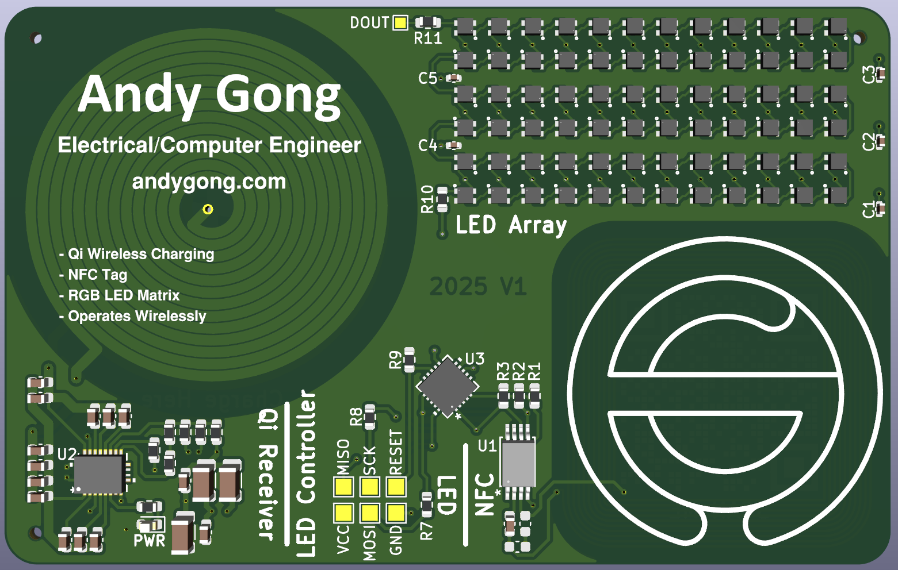
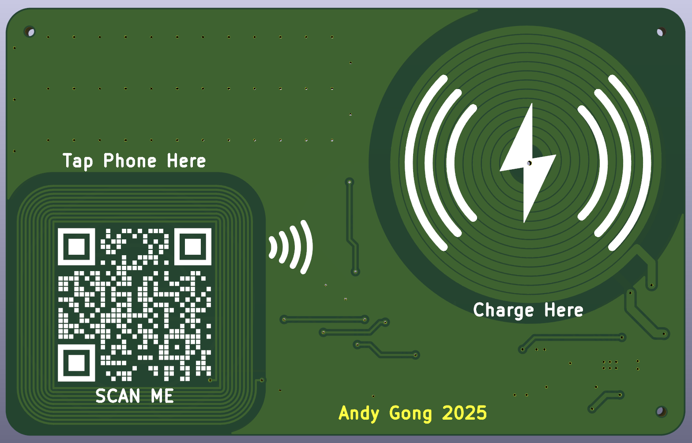
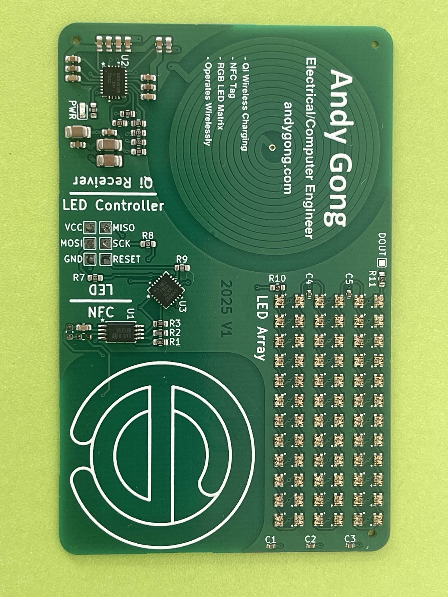
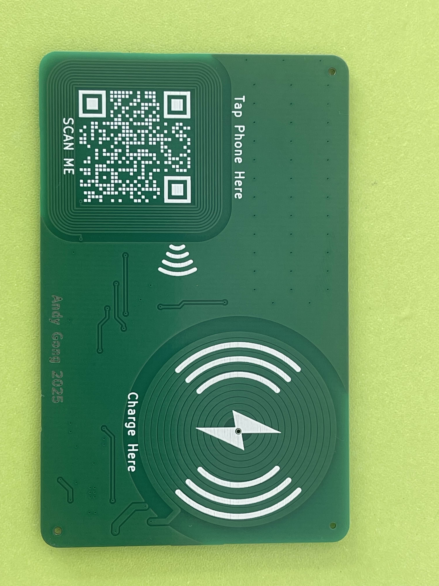

# pcb-business-card
Business card made using functional PCBs

Latest Revision: V1 (2025)

# Major Revisions:
## V1 (2025)
- Initial release of the PCB business card design.
- Design functions fully wirelessly, no need for any wired connections during operation. Maintains a slim profile (0.8mm thick PCB, with components on one side only).
- PCB dimensions: 85.6mm x 53.98mm (standard credit card size).
- Qi Wireless charging support -- Utilizes BQ51013B Qi Wireless Power Receiver IC to allow for wireless powering of the PCB business card in 5V 1A.
- NFC Tag support -- Utilizes ST25DV64K NFC Tag to allow for wirelessly programming of the RGB LED Matrix Display, while also allowing users to tap the card on their phone to load my website [andygong.com](https://andygong.com).
- RGB LED Matrix / Array Display -- Utilizes a 6x12 RGB LED Matrix of SK6805-EC15 LEDs to allow for colorful display of patterns that can be controlled by an on-board ATtiny84A microcontroller.
- The QR code on the back of the card can be scanned to load [andygong.com](https://andygong.com) as well.

PCB manufactured by [JLCPCB](https://jlcpcb.com/). Prototype boards assembled by [JLCPCB SMT Assembly Service](https://jlcpcb.com/smt-assembly). Further component sourcing and assembly done by myself.

### Images

#### Renders

#### Manufactured Board

#### Early Code Testing
`img/v1/v1_early_test.mov` -- Demonstrates simple patterns on the RGB LED Matrix, with an "Among Us" pixel art pattern shown at the end, which is data sent to the NFC tag by phone, and read by the ATTiny84 using I2C. The code snapshot is [HERE](https://github.com/AG2048/pcb-business-card/commit/e9710af22d912196d3559052da2425deacd2d185)